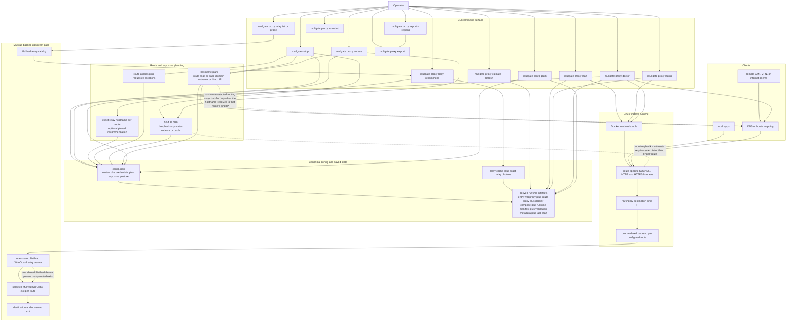

<p align="center">
  
</p>


<p align="center">
  <a href="https://github.com/Microck/mullgate/releases"></a>
  <a href="https://github.com/Microck/mullgate/actions/workflows/ci.yml"></a>
  <a href="LICENSE"></a>
</p>

---

`mullgate` turns one Mullvad subscription into many authenticated SOCKS5, HTTP, and HTTPS proxies for selected apps. it is built for operators who want a tiny command surface, route-specific exits, and app-level routing without sending the whole machine through a VPN.

the public CLI is now intentionally small:

- `mullgate setup` for onboarding
- `mullgate proxy ...` for daily runtime, access, export, and relay work
- `mullgate config ...` for raw paths and advanced config inspection

the main setup path is still `mullgate setup`. on a real terminal it opens a guided flow that collects your Mullvad account number, proxy credentials, route aliases, bind posture, and optional HTTPS settings, then persists canonical config plus the derived runtime artifacts needed for `proxy start`, `proxy status`, and `proxy doctor`. if you prefer automation, the same surface also supports a fully non-interactive env-driven setup path.

[documentation](https://mullgate.micr.dev) | [npm](https://www.npmjs.com/package/mullgate) | [github](https://github.com/Microck/mullgate)


## why

if you want Mullvad-backed proxy access without replacing your computer's normal network path, `mullgate` gives you a practical path.

- expose authenticated SOCKS5, HTTP, and HTTPS proxy endpoints from your own Mullvad subscription
- route only the traffic you choose instead of tunneling the whole machine
- scale 50 concurrent routed exits from one shared Mullvad WireGuard device instead of spending one device slot per route
- keep one small CLI for setup, proxy operations, relay selection, and diagnostics
- stay in control of the host and credentials instead of depending on a hosted relay service

## how mullgate differs from mullvad's socks5 proxy

mullvad's socks5 proxy is a socks5 endpoint inside the mullvad vpn tunnel. you connect to mullvad first, then manually point an app or browser at that proxy.

mullgate is a local operator layer built around a mullvad subscription. it provisions named exits, exposes authenticated socks5, http, and https proxy entrypoints on your machine, and gives you one cli surface for setup, exposure control, runtime checks, and failure diagnostics.

the goal is not "replace mullvad's proxy page with another set of manual steps." the goal is to give self-hosters a managed proxy gateway that uses mullvad exits without forcing the whole machine through the vpn.

mullgate solves mullvad's device cap by provisioning one shared wireguard entry device and fanning out to exact mullvad socks5 exits per route. the current linux runtime has been live-verified with 50 routed exits on one shared mullvad device, with 50 of 50 socks5, 50 of 50 http, and 50 of 50 https checks passing.

## architecture



the diagram above shows the current shipped mullgate model end to end: setup writes canonical config, exposure defines bind-ip and hostname truth, relay tooling can pin exact exits, `start` renders and launches the shared-entry runtime, clients hit route-specific listeners, and `status` plus `doctor` inspect the same saved and live surfaces. on linux, this runtime has been live-proven with 50 routes on one shared mullvad device.

## quickstart

`mullgate` currently requires Node.js 22+.

install from npm for the normal path, or use a GitHub release standalone binary/archive when you want a pinned platform artifact.

### Linux or macOS

```bash
curl -fsSL https://raw.githubusercontent.com/Microck/mullgate/main/scripts/install.sh | sh
mullgate --help
```

### Windows

```powershell
irm https://raw.githubusercontent.com/Microck/mullgate/main/scripts/install.ps1 | iex
mullgate --help
```

### using a package manager

```bash
npm install -g mullgate
pnpm add -g mullgate
bun add -g mullgate
```

### first run

for an interactive setup flow:

```bash
mullgate setup
```

for non-interactive setup, start from [`.env.example`](.env.example) and then run:

```bash
mullgate setup --non-interactive
mullgate proxy access
mullgate proxy export --regions
mullgate proxy export --guided
mullgate proxy start
mullgate proxy status
mullgate proxy doctor
```

## 50-proxy proof

the current linux runtime has already been proven at the headline scale this repo cares about:

- one shared Mullvad device
- 50 concurrent routed proxies
- 50 of 50 socks5 checks passed
- 50 of 50 http checks passed
- 50 of 50 https checks passed
- 50 distinct exit IPs observed

the demo above is the proof summary. the setup flow still matters, but it is no longer the main story.


In loopback mode, the direct bind-IP entrypoints reported by `mullgate proxy status` and `mullgate proxy access` are the canonical local access path. `mullgate proxy access` now combines the old exposure and hosts views into one access report.

If an installed `mullgate` command reports an unsupported config version, treat that as stale local state. Back up or remove the config/runtime paths it prints, then rerun `mullgate setup` and `mullgate proxy start` instead of trying to reuse the old runtime in place.

## platform support

`mullgate` is currently a Linux-first runtime with truthful cross-platform install, config, and diagnostics surfaces.

| platform | install | `path` / `status` / `doctor` | full runtime execution |
| --- | --- | --- | --- |
| Linux | Supported | Supported | **Supported** |
| macOS | Supported | Supported | **Partial** |
| Windows | Supported | Supported | **Partial** |

macOS and Windows can install the CLI and report config/runtime state truthfully, but the current Docker-first multi-route runtime still depends on Linux host-networking behavior. use Linux for the full setup and live runtime path.

## command surface

| root | main use |
| --- | --- |
| `mullgate setup` | guided or automated onboarding that writes canonical config and derived runtime artifacts |
| `mullgate proxy ...` | daily operations: access, export, runtime start/status/doctor, validation, relay tuning, and autostart |
| `mullgate config ...` | raw config/path inspection and advanced config edits |

Most-used commands:

| command | purpose |
| --- | --- |
| `mullgate proxy access` | inspect or update hostnames, bind IPs, DNS guidance, and direct-IP entrypoints |
| `mullgate proxy start` | launch the runtime |
| `mullgate proxy status` | inspect live runtime state |
| `mullgate proxy doctor` | diagnose routing, hostname, and runtime failures |
| `mullgate proxy export --regions` | list the built-in region groups |
| `mullgate proxy export --guided` | generate client-ready proxy inventories |
| `mullgate proxy relay list|probe|recommend|verify` | inspect relays, pick exact exits, and verify route behavior |
| `mullgate config path` | print config/state/cache/runtime paths and platform posture |

## examples

set up two named exits and inspect the generated hostname mappings:

```bash
export MULLGATE_ACCOUNT_NUMBER=123456789012
export MULLGATE_PROXY_USERNAME=alice
export MULLGATE_PROXY_PASSWORD='replace-me'
export MULLGATE_LOCATIONS=sweden-gothenburg,austria-vienna

mullgate setup --non-interactive
mullgate proxy access
```

start the runtime and inspect its current posture:

```bash
mullgate proxy start
mullgate proxy status
mullgate proxy doctor
```

use one of the exposed routes from another client or shell:

```bash
curl \
  --proxy socks5h://127.0.0.1:1080 \
  --proxy-user "$MULLGATE_PROXY_USERNAME:$MULLGATE_PROXY_PASSWORD" \
  https://am.i.mullvad.net/json
```

generate a shareable proxy list from the saved route inventory:

```bash
mullgate proxy export --regions
mullgate proxy export --guided
mullgate proxy export --country se --city got --count 1 --region europe --provider m247 --owner mullvad --run-mode ram --min-port-speed 9000 --count 2 --output proxies.txt
mullgate proxy export --dry-run --protocol http --country us --server us-nyc-wg-001 --owner rented
```

inspect candidate relays, preview the fastest exact match, then verify a configured exit:

```bash
mullgate proxy relay list --country Sweden --owner mullvad --run-mode ram --min-port-speed 9000
mullgate proxy relay probe --country Sweden --count 2
mullgate proxy relay recommend --country Sweden --count 1
mullgate proxy relay recommend --country Sweden --count 1 --apply
mullgate proxy relay verify --route sweden-gothenburg
```

enable login-time startup on Linux when you want the proxy runtime to come back automatically:

```bash
mullgate proxy autostart enable
mullgate proxy autostart status
```

## documentation

- [documentation site](https://mullgate.micr.dev)
- [quickstart](https://mullgate.micr.dev/docs/getting-started/quickstart)
- [usage guide](https://mullgate.micr.dev/docs/guides/usage)
- [setup and exposure](https://mullgate.micr.dev/docs/guides/setup-and-exposure)
- [command reference](https://mullgate.micr.dev/docs/reference/commands)
- [troubleshooting](https://mullgate.micr.dev/docs/guides/troubleshooting)
- [`.env.example`](.env.example) - documented setup inputs for local runs

## disclaimer

this project is unofficial and not affiliated with, endorsed by, or connected to Mullvad VPN AB. it is an independent, community-built tool.

## license

[mit license](LICENSE)
