<p align="center">
  
</p>

<p align="center">
  <a href="https://github.com/Microck/mullgate/releases"></a>
  <a href="https://www.npmjs.com/package/mullgate"></a>
  <a href="https://github.com/Microck/mullgate/actions/workflows/ci.yml"></a>
  <a href="LICENSE"></a>
</p>

---

`mullgate` turns one Mullvad subscription into many authenticated SOCKS5, HTTP, and HTTPS proxies for selected apps. it is built for operators who want route-specific exits, app-level routing, and clear operator surfaces without sending the whole machine through a VPN.

the main setup path is `mullgate setup`. on a real terminal it opens a guided flow that collects your Mullvad account number, proxy credentials, route aliases, bind posture, and optional HTTPS settings, then persists canonical config plus the derived runtime artifacts needed for `proxy start`, `proxy status`, and `proxy doctor`. if you prefer automation, the same surface also supports a fully non-interactive env-driven setup path.

[documentation](https://mullgate.micr.dev) | [npm](https://www.npmjs.com/package/mullgate) | [github](https://github.com/Microck/mullgate)

<p align="center">
  
</p>

## table of contents

- [why](#why)
- [how mullgate differs from mullvad's socks5 proxy](#how-mullgate-differs-from-mullvads-socks5-proxy)
- [architecture](#architecture)
- [requirements](#requirements)
- [quickstart](#quickstart)
- [platform support](#platform-support)
- [command surface](#command-surface)
- [examples](#examples)
- [documentation](#documentation)
- [contributing](#contributing)
- [security](#security)
- [changelog](#changelog)
- [license](#license)

## why

if you want Mullvad-backed proxy access without replacing your computer's normal network path, `mullgate` gives you a practical path.

- expose authenticated SOCKS5, HTTP, and HTTPS proxy endpoints from your own Mullvad subscription
- route only the traffic you choose instead of tunneling the whole machine
- scale many routed exits from one shared Mullvad WireGuard device instead of spending one device slot per route
- keep setup, proxy operations, relay selection, and diagnostics in one CLI
- stay in control of the host and credentials instead of depending on a hosted relay service

## how mullgate differs from mullvad's socks5 proxy

mullvad's socks5 proxy is a socks5 endpoint inside the mullvad vpn tunnel. you connect to mullvad first, then manually point an app or browser at that proxy.

mullgate is a local operator layer built around a mullvad subscription. it provisions named exits, exposes authenticated socks5, http, and https proxy entrypoints on your machine, and gives you one cli surface for setup, exposure control, runtime checks, and failure diagnostics.

the goal is not "replace mullvad's proxy page with another set of manual steps." the goal is to give self-hosters a managed proxy gateway that uses mullvad exits without forcing the whole machine through the vpn.

mullgate solves mullvad's device cap by provisioning one shared wireguard entry device and fanning out to exact mullvad socks5 exits per route.

## architecture

```mermaid
flowchart TB
    operator[Operator]

    subgraph cli[CLI command surface]
        setup[mullgate setup]
        access[mullgate proxy access]
        export[mullgate proxy export]
        exportRegions[mullgate proxy export --regions]
        relays[mullgate proxy relay list or probe]
    recommend[mullgate proxy relay recommend]
    validate[mullgate proxy validate --refresh]
    start[mullgate proxy start]
    dryRun[mullgate proxy start --dry-run]
    stop[mullgate proxy stop]
    restart[mullgate proxy restart]
    status[mullgate proxy status]
    logs[mullgate proxy logs]
    doctor[mullgate proxy doctor]
    autostart[mullgate proxy autostart]
    version[mullgate version]
    completions[mullgate completions bash]
    path[mullgate config path]
    end

    subgraph state[Canonical config and saved state]
        config[config.json\nroutes plus credentials plus exposure posture]
        cache[relay cache plus exact relay choices]
        artifacts[derived runtime artifacts\nentry-wireproxy plus route-proxy plus docker-compose plus runtime-manifest plus validation metadata plus last-start]
    end

    subgraph planner[Route and exposure planning]
        routeIntent[route aliases plus requested locations]
        bindPlan[bind IP plan\nloopback or shared private host or public]
        hostnamePlan[hostname plan\nroute alias or base-domain hostname or direct IP]
        exactExit[exact relay hostname per route\noptional pinned recommendation]
    end

    subgraph runtime[Linux-first live runtime]
        listeners[route-specific or shared-selector SOCKS5, HTTP, and HTTPS listeners]
        router[routing by shared-host ports, destination bind IP, or selector username]
        backends[one rendered backend per configured route]
        docker[Docker runtime bundle]
    end

    subgraph clients[Clients]
        localClient[local apps]
        remoteClient[remote LAN, VPN, or internet clients]
        dns[DNS or hosts mapping]
    end

    subgraph upstream[Mullvad-backed upstream path]
        relayCatalog[Mullvad relay catalog]
        wg[one shared Mullvad WireGuard entry device]
        selectedRelay[selected Mullvad SOCKS5 exit per route]
        destination[destination and observed exit]
    end

    operator --> setup
    operator --> access
    operator --> exportRegions
    operator --> export
    operator --> relays
    operator --> recommend
    operator --> validate
    operator --> start
    operator --> dryRun
    operator --> stop
    operator --> restart
    operator --> status
    operator --> logs
    operator --> doctor
    operator --> autostart
    operator --> version
    operator --> completions
    operator --> path

    setup --> config
    setup --> routeIntent
    setup --> bindPlan
    setup --> hostnamePlan
    access --> bindPlan
    access --> hostnamePlan
    access --> config
    exportRegions --> export
    relays --> relayCatalog
    relayCatalog --> recommend
    recommend --> exactExit
    recommend --> cache
    exactExit --> config

    routeIntent --> config
    bindPlan --> config
    hostnamePlan --> config
    config --> artifacts
    cache --> artifacts
    validate --> artifacts
    start --> artifacts
    start --> docker
    docker --> listeners
    listeners --> router
    router --> backends
    backends --> wg
    wg --> selectedRelay
    selectedRelay --> destination

    localClient --> listeners
    remoteClient --> dns
    dns --> listeners
    hostnamePlan --> dns

    status --> artifacts
    status --> docker
    doctor --> config
    doctor --> artifacts
    doctor --> dns
    doctor --> docker
    path --> config
    path --> artifacts

    bindPlan -.private-network reuses one trusted host IP; public still needs distinct bind IPs per route.-> listeners
    hostnamePlan -.private-network hostnames can share one host IP because route selection moves to per-route ports.-> dns
    wg -.one shared Mullvad device powers many routed exits.-> selectedRelay
```



the diagram above shows the current shipped mullgate model end to end: setup writes canonical config, exposure defines the published host and hostname truth, relay tooling can pin exact exits, `start` renders and launches the shared-entry runtime, clients hit route-specific listeners, and `status` plus `doctor` inspect the same saved and live surfaces.

## requirements

| requirement | minimum version |
| --- | --- |
| Node.js | 22+ |
| Docker | required for full runtime execution |
| Mullvad account | active subscription with WireGuard access |

Linux is required for the full runtime. macOS and Windows support install, config, and diagnostics only.

## quickstart

install from npm for the normal path, or use a GitHub release standalone binary/archive when you want a pinned platform artifact.

### Linux or macOS

```bash
curl -fsSL https://raw.githubusercontent.com/Microck/mullgate/main/scripts/install.sh | sh
mullgate --help
```

### Windows

```powershell
irm https://raw.githubusercontent.com/Microck/mullgate/main/scripts/install.ps1 | iex
mullgate --help
```

### using a package manager

```bash
npm install -g mullgate
pnpm add -g mullgate
bun add -g mullgate
```

### first run

for an interactive setup flow:

```bash
mullgate setup
```

for non-interactive setup, start from [`.env.example`](.env.example) and then run:

```bash
mullgate setup --non-interactive
mullgate proxy access
mullgate proxy export --regions
mullgate proxy export --guided
mullgate proxy start --dry-run
mullgate proxy start
mullgate proxy status
mullgate proxy logs --tail 50
mullgate proxy doctor
```


In loopback mode, the direct bind-IP entrypoints reported by `mullgate proxy status` and `mullgate proxy access` are the canonical local access path. `mullgate proxy access` now combines the old exposure and hosts views into one access report, and it is also where you switch between the default `published-routes` model and the opt-in `inline-selector` model.

If an installed `mullgate` command reports an unsupported config version, treat that as stale local state. Back up or remove the config/runtime paths it prints, then rerun `mullgate setup` and `mullgate proxy start` instead of trying to reuse the old runtime in place.

## platform support

`mullgate` is currently a Linux-first runtime with truthful cross-platform install, config, and diagnostics surfaces.

| platform | install | `path` / `status` / `doctor` | full runtime execution |
| --- | --- | --- | --- |
| Linux | Supported | Supported | **Supported** |
| macOS | Supported | Supported | **Partial** |
| Windows | Supported | Supported | **Partial** |

macOS and Windows can install the CLI and report config/runtime state truthfully, but the current Docker-first multi-route runtime still depends on Linux host-networking behavior. use Linux for the full setup and live runtime path.

## command surface

| command | key flags | purpose |
| --- | --- | --- |
| `mullgate setup` | `--non-interactive`, `--location`, `--exposure-mode` | create or update canonical config and derived runtime artifacts |
| `mullgate proxy access` | `--mode`, `--access-mode`, `--base-domain`, `--route-bind-ip` | inspect or update exposure posture, access mode, shared-host planning, DNS guidance, selector examples, and direct-IP entrypoints |
| `mullgate proxy export` | `--regions`, `--guided`, selector flags | list region groups or generate client-ready proxy inventories for `published-routes` mode |
| `mullgate proxy relay list` | selector flags such as `--country`, `--owner`, `--provider` | inspect relay candidates that match a policy |
| `mullgate proxy relay probe` | `--country`, `--count` | latency-probe likely relay candidates |
| `mullgate proxy relay recommend` | `--country`, `--count`, `--apply` | preview or pin an exact relay choice |
| `mullgate proxy relay verify` | `--route` | verify a configured route across the published proxy protocols |
| `mullgate proxy validate` | `--refresh` | refresh saved validation metadata and config-derived artifacts |
| `mullgate proxy start` | `--dry-run` | render and validate artifacts, then optionally launch the runtime |
| `mullgate proxy stop` | none | stop the saved Docker runtime bundle without rerendering artifacts |
| `mullgate proxy restart` | none | stop the current bundle, rerender artifacts, and start it again |
| `mullgate proxy status` | none | inspect live runtime state |
| `mullgate proxy logs` | `--tail`, `--follow` | read the saved Docker Compose logs for the current runtime bundle |
| `mullgate proxy doctor` | none | diagnose routing, hostname, and runtime failures |
| `mullgate proxy autostart` | `enable`, `disable`, `status` | manage login-time startup on supported platforms |
| `mullgate config path` | none | print config, state, cache, and runtime paths |
| `mullgate config show` | none | print the saved canonical config |
| `mullgate config get` | `<key>` | read one saved config value |
| `mullgate config set` | `<key> <value>` | update one saved config value |
| `mullgate version` | none | print CLI version plus support metadata |
| `mullgate completions <shell>` | `bash`, `zsh`, `fish` | generate shell completion scripts |

for operator workflows, `mullgate proxy start --dry-run` is the safe preflight path before touching Docker, `mullgate proxy logs` is the first live-runtime evidence surface after `status`, and `mullgate proxy restart` is the canonical "rerender + bounce" shortcut once setup is already saved.

## examples

set up two named exits and inspect the generated hostname mappings:

```bash
export MULLGATE_ACCOUNT_NUMBER=123456789012
export MULLGATE_PROXY_USERNAME=alice
export MULLGATE_PROXY_PASSWORD='replace-me'
export MULLGATE_LOCATIONS=sweden-gothenburg,austria-vienna

mullgate setup --non-interactive
mullgate proxy access
```

set up private-network exposure for other Tailscale devices. if Tailscale is running, Mullgate defaults to the host's `100.x` address; otherwise it falls back to `0.0.0.0` until you override the shared host:

```bash
export MULLGATE_EXPOSURE_MODE=private-network
export MULLGATE_BIND_HOST=100.124.44.113

mullgate setup --non-interactive
mullgate proxy access
```

switch that same trusted-network host to selector-driven access when you want one shared listener and route selection in the proxy username:

```bash
mullgate proxy access \
  --mode private-network \
  --access-mode inline-selector \
  --route-bind-ip 100.124.44.113
```

with `inline-selector`, the guaranteed URL shape is `scheme://selector:@host:port`. for example:

```text
socks5://se:@100.124.44.113:1080
socks5://se-got:@100.124.44.113:1080
socks5://se-got-wg-101:@100.124.44.113:1080
```

the shorter `scheme://selector@host:port` form is best-effort only because some clients do not normalize a missing password consistently. if you expose `inline-selector` on a public host with an empty password, Mullgate blocks that by default until you opt in with `--unsafe-public-empty-password`.

start the runtime and inspect its current posture:

```bash
mullgate proxy start
mullgate proxy status
mullgate proxy doctor
```

use one of the exposed routes from another client or shell:

```bash
curl \
  --proxy socks5h://127.0.0.1:1080 \
  --proxy-user "$MULLGATE_PROXY_USERNAME:$MULLGATE_PROXY_PASSWORD" \
  https://am.i.mullvad.net/json
```

generate a shareable proxy list from the saved route inventory:

```bash
mullgate proxy export --regions
mullgate proxy export --guided
mullgate proxy export --country se --city got --count 1 --region europe --provider m247 --owner mullvad --run-mode ram --min-port-speed 9000 --count 2 --output proxies.txt
mullgate proxy export --dry-run --protocol http --country us --server us-nyc-wg-001 --owner rented
```

`mullgate proxy export` currently supports `published-routes` mode only. if you switch to `inline-selector`, use `mullgate proxy access` to inspect the shared listener and selector examples instead of expecting per-route export output.

inspect candidate relays, preview the fastest exact match, then verify a configured exit:

```bash
mullgate proxy relay list --country Sweden --owner mullvad --run-mode ram --min-port-speed 9000
mullgate proxy relay probe --country Sweden --count 2
mullgate proxy relay recommend --country Sweden --count 1
mullgate proxy relay recommend --country Sweden --count 1 --apply
mullgate proxy relay verify --route sweden-gothenburg
```

enable login-time startup on Linux when you want the proxy runtime to come back automatically:

```bash
mullgate proxy autostart enable
mullgate proxy autostart status
```

`mullgate proxy autostart enable` now ensures `loginctl` linger is enabled for the current user, because a `systemd --user` unit does not reliably come back after reboot without it.

## documentation

- [documentation site](https://mullgate.micr.dev)
- [quickstart](https://mullgate.micr.dev/docs/getting-started/quickstart)
- [usage guide](https://mullgate.micr.dev/docs/guides/usage)
- [setup and exposure](https://mullgate.micr.dev/docs/guides/setup-and-exposure)
- [command reference](https://mullgate.micr.dev/docs/reference/commands)
- [troubleshooting](https://mullgate.micr.dev/docs/guides/troubleshooting)
- [`.env.example`](.env.example) - documented setup inputs for local runs

## contributing

contributions are welcome. see [CONTRIBUTING.md](CONTRIBUTING.md) for setup instructions, code style expectations, and the PR process.

## security

found a vulnerability? please report it responsibly via [SECURITY.md](SECURITY.md).

## changelog

see [CHANGELOG.md](CHANGELOG.md) for release history and breaking changes.

## disclaimer

this project is unofficial and not affiliated with, endorsed by, or connected to Mullvad VPN AB. it is an independent, community-built tool.

## license

[mit license](LICENSE)
