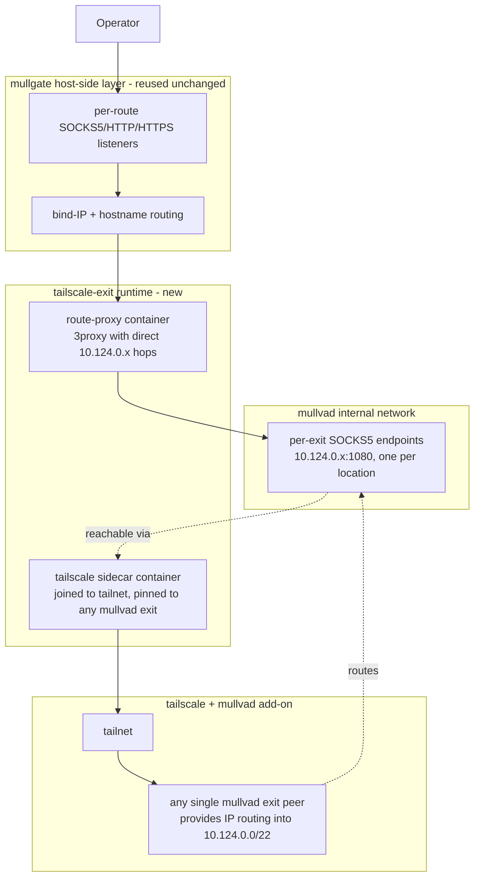

# TAILSCALE.md

## status

viable. verified by hands-on test against a real tailnet with the mullvad add-on (june 2026). this is the plan for adding the mullvad-via-tailscale add-on as an alternative exit source, preserving mullgate's core property: one subscription = N concurrent named mullvad exits.

## tl;dr

- one `tailscaled` instance pinned to any mullvad exit can reach **all** mullvad per-exit SOCKS5 endpoints directly by IP (10.124.0.x). proven empirically.
- this is a new **exit-source mode** (`tailscale-exit`) alongside the current `mullvad-wireguard-socks`. opt-in, non-breaking.
- the change is **smaller than m004**: mullgate's host-side layer (listeners, bind-IP planning, hostname routing, exposure modes) is reused unchanged. only the entry transport and exit-IP resolution path change.
- per-exit SOCKS5 IPs resolve via **public DNS** (DNSSEC-signed `*.relays.mullvad.net`), not mullvad's internal DNS.

## the proven mechanism

hands-on test against a real tailnet with the add-on:

1. `tailscale set --exit-node=fr-par-wg-001.mullvad.ts.net` - pinned to paris.
2. `curl --socks5-hostname 10.124.0.20:1080 https://am.i.mullvad.net/json` - direct connection to the swedish per-exit SOCKS5 by IP.
3. **returned:** `{"ip":"185.213.154.217","country":"Sweden","city":"Gothenburg","mullvad_exit_ip_hostname":"se-got-wg-socks5-001","mullvad_server_type":"SOCKS through WireGuard"}`

interpretation: a single tailscaled, pinned to one mullvad exit, provides IP-level routing into mullvad's internal network. the per-exit SOCKS5 endpoints (10.124.0.0/22) are reachable directly by IP. 3proxy can therefore open N concurrent SOCKS5 connections to N distinct 10.124.0.x addresses and exit through N distinct mullvad locations, exactly as it does today.

key correction: tailscale's `autogroup:internet` RFC1918 filter (`remove 10.0.0.0/8`, per tailscale/tailscale#5412) does NOT block mullvad's internal ranges when the exit is a mullvad node. mullvad advertises these routes through the exit-node abstraction.

## how it works

| layer | current `mullvad-wireguard-socks` mode | new `tailscale-exit` mode |
|---|---|---|
| entry tunnel | wireproxy + 1 mullvad wireguard device | tailscaled pinned to any mullvad exit |
| reach per-exit SOCKS5 | via internal DNS (10.64.0.1) inside the WG tunnel | directly by IP (10.124.0.x) |
| 3proxy chain | two hops: entry SOCKS5 -> per-exit SOCKS5 hostname | single hop: direct to 10.124.0.x:1080 |
| hostname -> IP mapping | internal DNS resolution at runtime | public DNS (`*.relays.mullvad.net`, DNSSEC-signed) cached at render time |
| credentials | mullvad account number | tailscale auth key + tailnet name |
| container count | 3 (entry-tunnel, route-proxy, routing-layer) | 2 (tailscale-sidecar, route-proxy) + routing-layer unchanged |

simplifications vs current mode:

- no mullvad WireGuard key provisioning (`provision-wireguard.ts` is bypassed).
- no internal DNS dependency (no `DNS = 10.64.0.1` in any config).
- 3proxy config drops the `parent 1000 socks5+ 127.0.0.1 <entry-port>` first hop.

## architecture



note: the tailscale sidecar provides network reachability; 3proxy in the route-proxy container connects directly to 10.124.0.x. both containers share a network namespace (or the sidecar acts as the route-proxy's gateway).

## what is reused unchanged

- canonical config + schema (extended with a new `exitSource` discriminator)
- exposure modes (`loopback`, `private-network`, `public`)
- bind-IP planning, hostname planning, DNS/hosts guidance
- `inline-selector` and `published-routes` access modes
- `proxy access`, `proxy list`, `proxy status`, `proxy doctor`, `proxy logs` (adapted)
- HTTPS layer (HAProxy routing-layer container, TLS assets)
- `relay recommend/probe/verify` (retargeted to use public DNS for IP mapping)
- autostart, completions, config path/show/get/set

## what is new

- `exitSource` discriminator in config: `mullvad-wireguard-socks` (default) | `tailscale-exit`
- `mullvad.tailscale` config block: tailnet name, auth key (or api token)
- tailscale sidecar container (compose service: joins tailnet, pins to a mullvad exit)
- public-DNS resolver step: map relay hostnames -> 10.124.0.x IPs at render time, cache alongside the relay catalog
- simplified 3proxy renderer for `tailscale-exit` (single-hop `socks5+ <ip> 1080` per route)
- new doctor checks: tailscale peer status, exit-node pinned, 10.124.0.x reachability, egress verify

## config schema delta (sketch)

```yaml
mullvad:
  exitSource: mullvad-wireguard-socks   # existing default
              # | tailscale-exit        # new

  wireguard: ...                        # unchanged, ignored when exitSource = tailscale-exit

  tailscale:                            # new block, used only when exitSource = tailscale-exit
    tailnet: "<tailnet-name>.ts.net"
    authKey: "<tailscale auth key>"     # or api token for ephemeral key minting
    pinnedExitNode: fr-par-wg-001       # any mullvad exit; just provides IP routing

routing:
  locations:
    - alias: sweden-gothenburg
      mullvad:
        exit:
          # existing fields (relayHostname, socksHostname, socksPort) reused
          # new: socksInternalIp resolved from public DNS and cached
          socksInternalIp: 10.124.0.20
```

## implementation phases

modeled on mullgate's milestone style (m004 ran feasibility -> compatibility -> milestone contracts).

- **phase 1 - feasibility verifier.** isolated experiment modeled on `src/m004/feasibility-runner.ts`: spin up tailscaled in a container, pin to a mullvad exit, resolve 3 distinct 10.124.0.x IPs via public DNS, run concurrent probes through each, verify 3 distinct observed exits. must prove concurrent distinct exits before any integration work.
- **phase 2 - public DNS mapping layer.** extend `fetch-relays.ts` (or add a sibling module) to resolve each relay's `*.relays.mullvad.net` hostname to its 10.124.0.x IP via public DNSSEC-signed DNS. cache alongside the existing relay catalog.
- **phase 3 - config schema + setup flow.** add `exitSource` discriminator and `mullvad.tailscale` block. branch the setup flow for tailscale auth-key + tailnet name in place of mullvad account number.
- **phase 4 - runtime renderer.** new compose topology: tailscale sidecar + route-proxy sharing a namespace. simplified 3proxy config with single-hop `socks5+ <ip> 1080` per route.
- **phase 5 - operator surface.** adapt `status`/`doctor` for the new mode. add doctor checks for tailscale peer status, pinned exit, 10.124.0.x reachability.
- **phase 6 - contracts + docs.** compatibility contract, milestone decision bundle, docs-site page.

## operator impact

- new env/config: tailscale auth key + tailnet name (replaces mullvad account number for this mode).
- lighter runtime than m004's worst case: 1 tailscaled sidecar + 1 route-proxy + existing routing-layer. no per-exit containers.
- tailscale add-on license considerations: 1 device (the sidecar) consumes 1 license slot. the operator's other tailnet devices do not.
- linux-only at launch for the full runtime (same as today).
- non-breaking: existing `mullvad-wireguard-socks` setups are untouched.

## research history (what was ruled out)

documented so future work does not re-litigate settled questions.

| path | verdict | evidence |
|---|---|---|
| concurrent multi-exit from one tailscaled via per-exit SOCKS5 by IP | **WORKS** (this plan) | hands-on test, june 2026 |
| tailscale RFC1918 filter blocks 10.64.0.1 | false | hands-on test: 10.64.0.1:1080 reachable, returned valid JSON |
| tailscale RFC1918 filter blocks 10.124.0.x | false | hands-on test: 10.124.0.20:1080 reachable, returned swedish exit |
| per-exit SOCKS5 hostnames via internal DNS (10.64.0.1) | not viable | hands-on test: NXDOMAIN (wrong hostname used; public DNS works) |
| SOCKS5 chaining via 10.64.0.1 -> 10.124.0.x | blocked | research: mullvad SOCKS5 returns "connection not allowed by ruleset" for RFC1918 destinations |
| auth-based exit selection on 10.64.0.1 | not supported | research: returns "no acceptable methods" when offered username/password |
| tailscale multi-exit-node policy routing | not implemented | tailscale/tailscale#3648 closed without implementation |
| app connectors / subnet routers / 4via6 / serve | orthogonal | research: none provide per-connection mullvad exit selection |
| N tailscaled containers (original TAILSCALE.md plan) | viable but inferior | research: works, but 25-exit cap, key rotation, heavy runtime |
| direct mullvad + tailscale-as-transport (tailbox pattern) | viable, no add-on needed | github.com/tdwgm/tailbox-server |

## decisions (locked)

these three decisions were resolved before phase 1. they are no longer open.

**D1 - credential surface: reusable auth key + persisted state volume.**

the sidecar persists its tailscale state directory in a docker volume. on first `proxy start`, the auth key bootstraps the node into the tailnet. on subsequent starts, the node reclaims its identity from the persisted state - no auth key needed. the 90-day auth-key expiry only bites if the state volume is lost (host rebuild, volume deletion). API-token support is deferred to a future enhancement for zero-touch fleet scenarios.

**D2 - container wiring: shared network namespace.**

the route-proxy container uses `network_mode: service:tailscale-sidecar`. both containers share one network stack, so 3proxy reaches `10.124.0.x:1080` directly through the sidecar's tailscale-routed network. the sidecar publishes the route-proxy's SOCKS5/HTTP/HTTPS listener ports to the host. this matches the proven tailbox pattern and avoids the sysctl/NAT/route complexity of gateway mode.

**D3 - metadata + IP source: relays API for metadata, public DNS for IPs.**

the existing `api.mullvad.net/www/relays/all/` endpoint (already consumed by `fetch-relays.ts`) remains the source of truth for exit metadata (country, city, provider, hostname, `socks_name`, `socks_port`). a new public-DNS resolution step maps each `<socks_name>.relays.mullvad.net` hostname to its `10.124.0.x` IP. both are cached alongside the existing relay catalog and refreshed via the existing `proxy validate --refresh` pattern. no scanning, no hardcoded tables.

## open questions

these remain open and should be resolved during phase 1 (feasibility verifier) or phase 4 (runtime renderer).

- **re-pinning latency.** how fast can the sidecar switch `--exit-node` at runtime without re-auth? affects whether operators can change the "carrier" exit without bouncing the runtime.
- **DERP fallback behavior.** if tailscale falls back to a DERP relay instead of direct wireguard, do the 10.124.0.x routes still work? what is the throughput impact?
- **10.124.0.0/22 layout stability.** are the IP-to-exit mappings stable enough to cache long-term, or do they rotate? if they rotate, mullgate needs a refresh interval.
- **public DNS resolution reliability.** is `*.relays.mullvad.net` consistently DNSSEC-signed and resolvable from arbitrary networks? fallback path if it is not.
- **tailscale sidecar privilege.** `tailscaled` needs `NET_ADMIN` for wireguard. userspace networking mode (`TS_USERSPACE=1`) avoids this but may have different reachability characteristics - verify in phase 1.

## assumptions

- operator has root (or docker + appropriate caps) on a linux host. same as today.
- operator has a tailscale tailnet with the mullvad add-on enabled and can mint auth keys.
- this is opt-in; it does not replace `mullvad-wireguard-socks` mode.
- macos/windows full runtime support is out of scope at launch.
