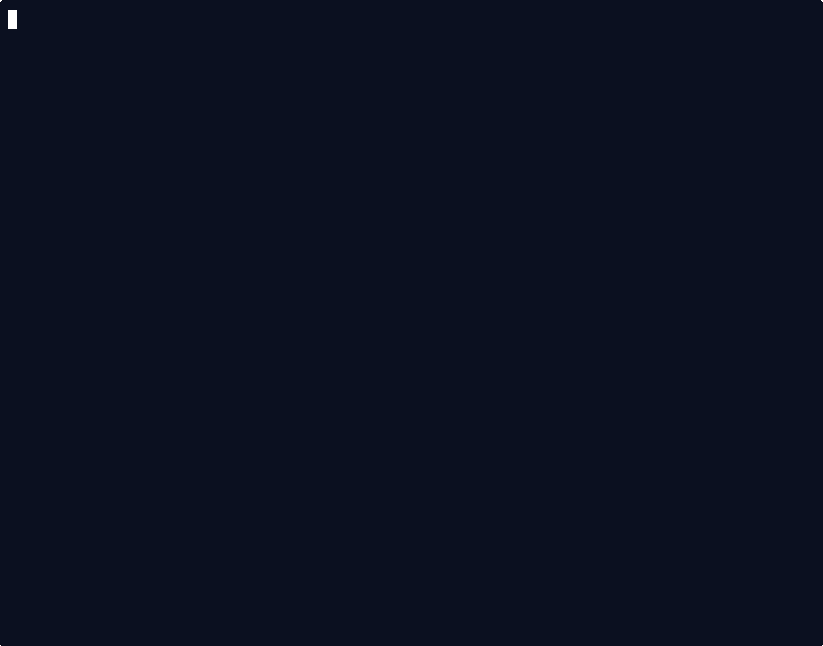
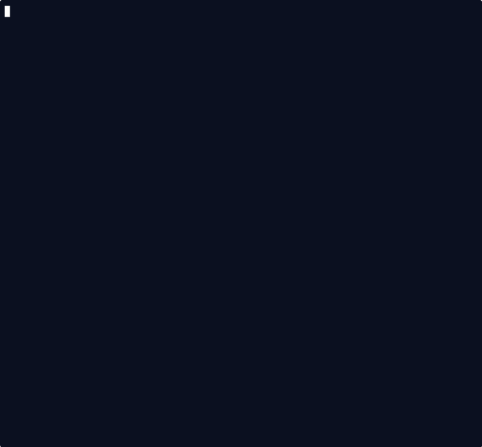

# Demos

These demo notes are for maintainers recording or verifying the GIFs used in the README and public docs.

They are not part of the public Mullgate operator docs.

## Preview

### Setup


### Private-network exposure



### Status and doctor



### Relay discovery and recommendation


## Regenerate

Prerequisites:

- `asciinema`
- `agg`
- `ffmpeg`
- project dependencies installed with `pnpm install`

From the repo root:

```bash
pnpm demo:record
pnpm demo:verify
```

The recording flow writes canonical assets to `images/demos/` and mirrors the same files into `docs/mullgate-docs/public/images/demos/`.

## Notes

- The setup GIF runs the real `mullgate setup --non-interactive` path against local fixture endpoints.
- The exposure GIF seeds a local config first, then records the real `mullgate exposure ...` output.
- The status and doctor GIF seeds a validated config plus a fake Docker Compose surface so the output stays deterministic and secret-safe.
- The relay recommendation GIF seeds a deterministic relay catalog plus fake `ping` output so list, probe, and recommend runs stay stable without live network latency.
- The GIF renderer uses a taller terminal plus a Mullvad-inspired dark navy, white, and yellow palette so long reports stay readable.
